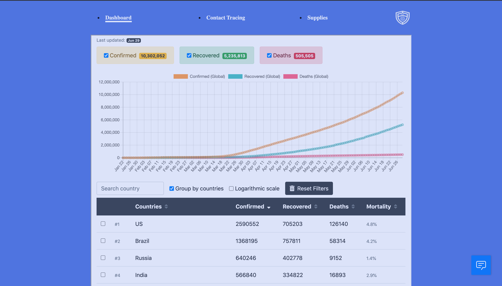
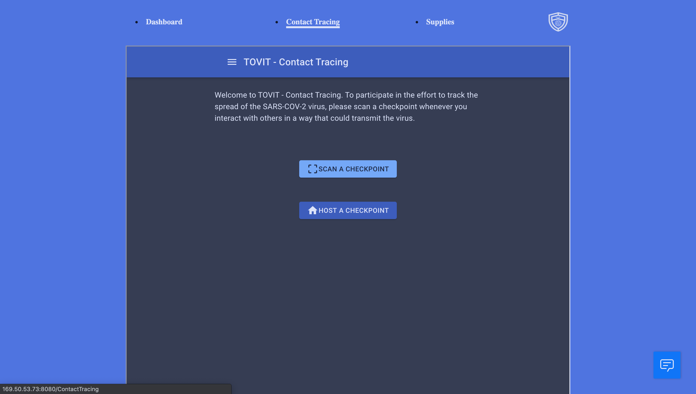
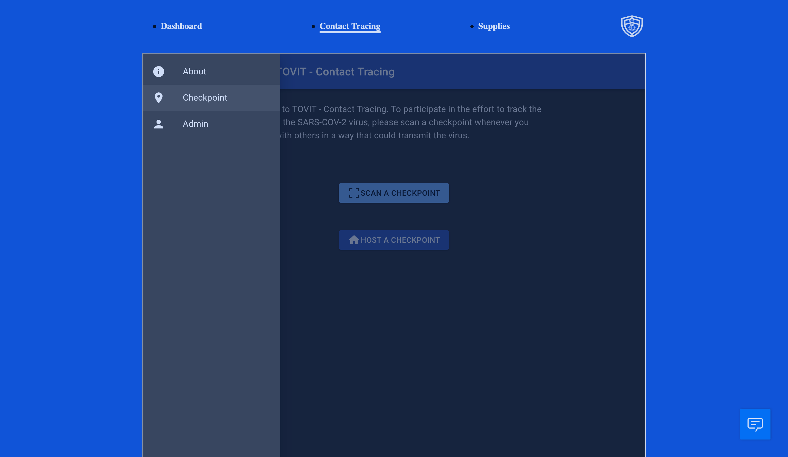
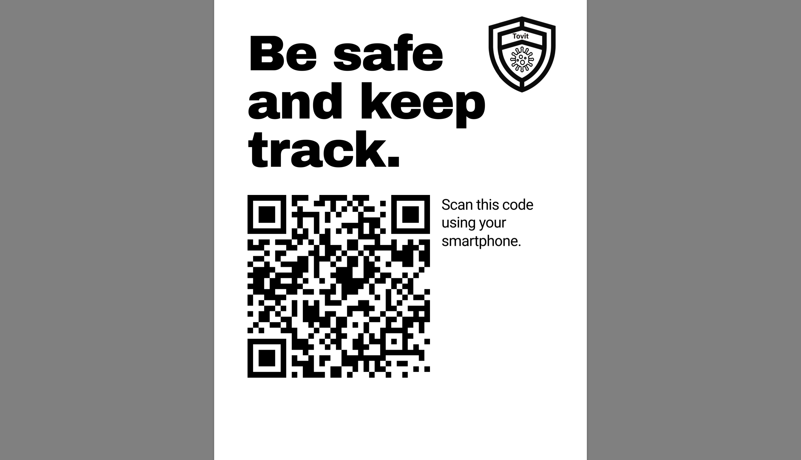
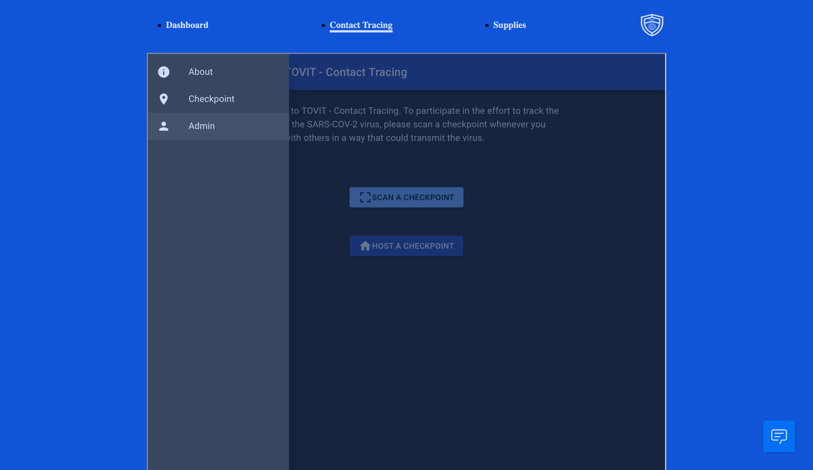
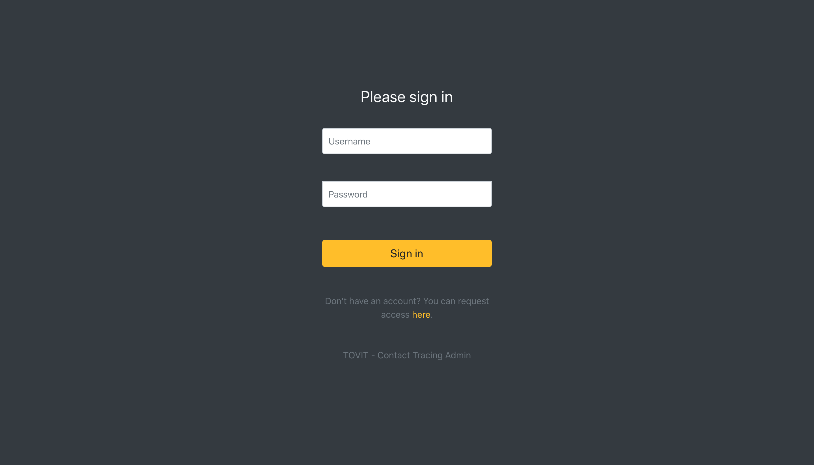
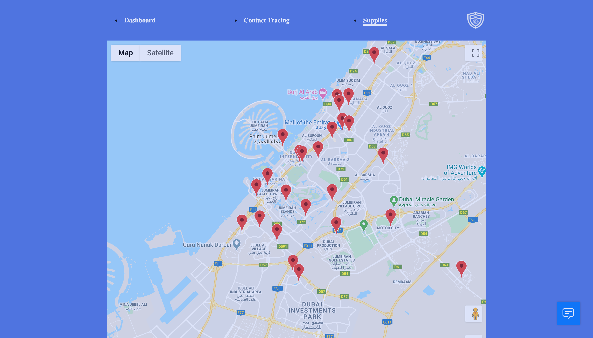
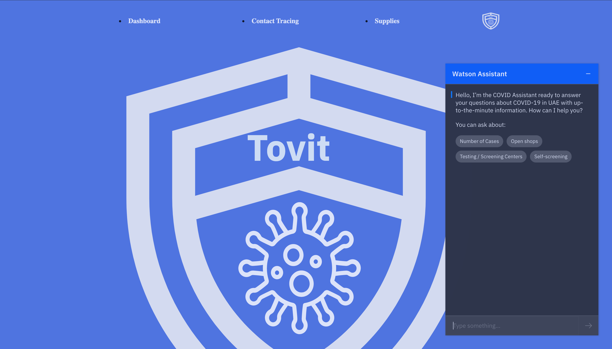
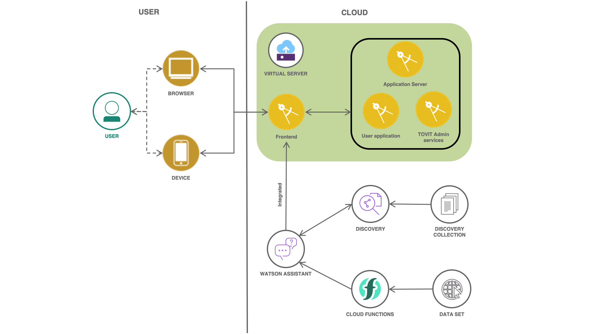

# Tovit - COVID-19 Toolkit

Tovit is a toolkit application for COVID-19. It is comprised of 4 main features. These include:

1. Dashboard:  The Dashboard displays important statistics regarding the COVID-19 pandemic such as the number of infections worldwide as well as per-country. 

2. Contact tracing: Tovit contains a contact tracing app built on the open source TrackCovid project (cite?). 

3. Supplies: The supplies feature can be used to locate essential supplies (supermarket locations) in the user's vicinity.

4. Chatbot: The application includes a chatbot built using Watson Assistant to answer users' questions around COVID-19

The sections below cover the individual features in more detail

[Project website](https://github.ibm.com/Mridul-Bhandari/Tovit)

### Dashboard

The dashboard built into Tovit helps users get an understanding of the rate of increase of COVID-19 both world wide as well as in their country. The dashboard dispalys the number of confirmed, recorvered and deaths by coronavirus per country. Data for the dashboard is from the COVID-19 (2019-nCoV) Data Repository by Johns Hopkins CSSE. The dashboard itself was influenced by the coronavirus dashboard found at https://github.com/trekhleb/covid-19.

### Contact Tracing

Digital contact tracing is an effective way to cut down on the spread of a disease. Contact tracing refers to keeping a log of locations an individual visits. In the event that the individual is found to test COVID-19 positive, an alert is sent to all users who visited a location that the COVID-19 positive user also visited. 

There are multiple ways to gather location information about a user to create a log. One example is reading the user's GPS coordinates at regular intervals. Tovit integrates the open source Track Covid project (https://github.com/tyleryasaka/TrackCOVID-community). When a user opens the contact tracing feature in Tovit, they can scan a QR code displayed at points of interest around their city. Upon scanning this QR code, a visit to the specified location is logged.  

### Supplies

Users can use Tovit to locate supermarkets in their area. A basic map is pulled using the Google maps API. To it, pointers to local supermarkets are added using the Frousquare API.

### Chatbot

Tovit contains a chatbot that users can interact with to answer common questions about the coronavirus. Questions include finding the nearest testing center and asking the chatbot about the number of new cases. The chatbot is built using IBM Watson Assistant. 

## Architecture

1. The application frontend resides on a Virtual Server on IBM Cloud. When the user interacts with TOVIT, they are interacting with this frontend.

2. The contact tracing application lives on the same virtual server. The contact tracing application consists of a frontend (that the user sees), a server that is responsible for storing visits and an admin service for where administrators of the application can add new users.

3. The supplies and dashboard application are built into the frontend.

4. The chatbot uses a Watson Assistant service on IBM Cloud. The chatbot also uses Watson Discovery to fetch data from Watson Discovery News. In addidtion, the chatbot uses IBM Cloud Functions to get the daily number of cases. This data is fetched from https://api.covid19api.com/summary

