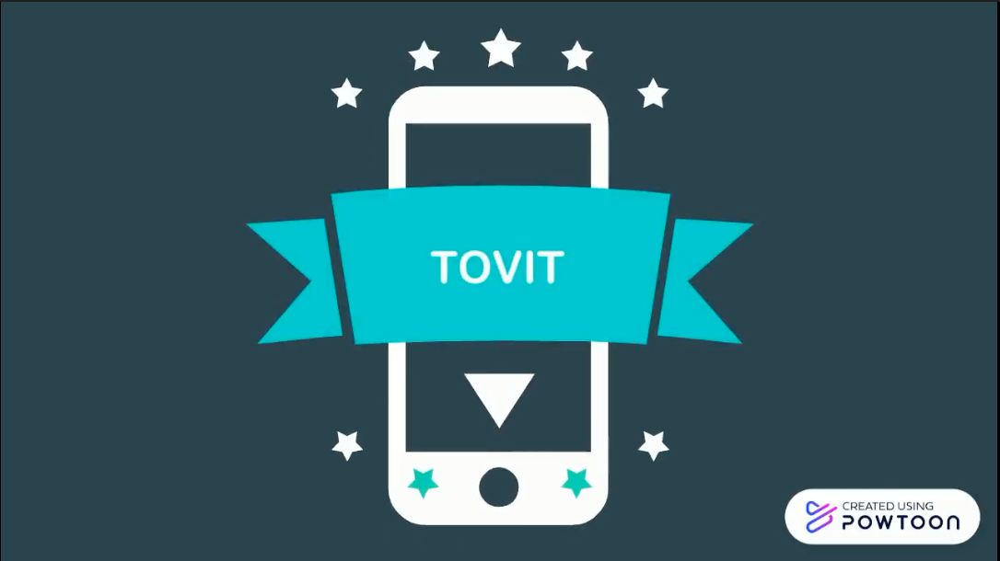
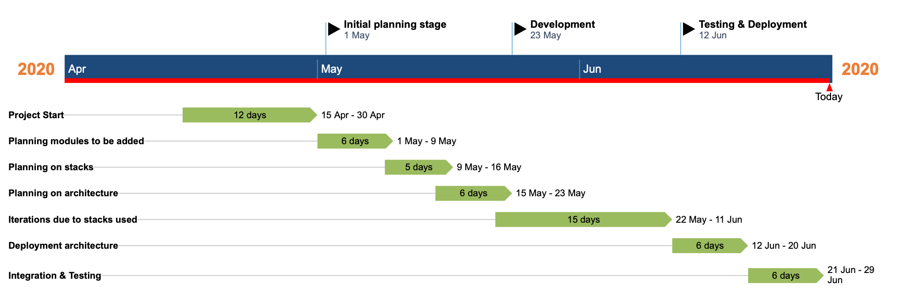

# Tovit - COVID-19 Toolkit

[](https://www.apache.org/licenses/LICENSE-2.0) [](https://callforcode.org/slack) [](http://169.50.53.73:8080)

## Contents

1. [Short description](#About-the-project)
1. [Demo video](#demo-video)
1. [The architecture](#the-architecture)
1. [Long description](#Project-details)
1. [Project roadmap](#Tovit-roadmap)
1. [Getting started](#getting-started)
1. [Live demo](#live-demo)
1. [Built with](#built-with)
1. [Contributing](#contributing)
1. [Authors](#authors)
1. [License](#license)
1. [Acknowledgments](#acknowledgments)

## About the project

### What's the problem?

Recently we went through a major change in life, we had to change how we live, how we work, and where we go. COVID-19 has been classified as a pandemic by the World Health Organization and with the cases raising daily, we can still say that we are not safe. With movement restrictions to lockdowns in many countries, COVID-19 has changed our life and our responsibility as humans is to stay safe and keep our loved ones safe.

### How can technology help?

There are many ways a person can stay safe, but to stay safe we all also need tools and guidance such as chatbots which give us information, dashboards which keep us up to date regarding the spread in the cases, maps and information about where someone can get supplies for their day to day life and a recent idea is called contact tracing which allows us to see where we have been and allows us to know where we have been aiding us to know if we could be contracted with COVID-19. With the help of the latest technologies such as Watson Assistant and Discovery and open source projects available, we can develop new applications and ideas which can help us aid the community.

### The idea

Our idea is to create a one-stop-app with all the assets you would require to stay safe from COVID-19. Our app consists of a dashboard which gives us a visualization of the number of cases by countries as well as global cases, we also have included an open-source contact tracing module within the app which will allow you to scan barcodes and even host barcodes in case you are a business and as the barcodes are scanned it keeps registering on to your browser and you have your key, you can also download your data and email it to the authorities in case you have been detected with COVID-19 which they can use to detect potential infections. Another module that we have in our application is a map that points to the closest supermarkets/groceries nearby your location allowing you to get your day-to-day needs from close by rather than going far as a further area could also lead to an infection. Last but not the least, we have a chatbot integrated into our application which gives more information about COVID-19 including a self-screening dialog that allows you to know if you may have been contracted with the virus or not. This application will allow users to use all these utilities to make sure that they are safe and up to date with the current development of COVID-19.

## Demo video

[](https://www.youtube.com/watch?v=YfvLV2NF-Zc)

## The architecture


1. The user selects a module such as a dashboard, supplies, or chatbot.
2. The dashboard gets appropriate data and displays the data on a chart.
3. Supplies map gets information from google maps API and displays supermarkets/groceries using Foursquare API.
4. Contact tracing is initiated and ran in the contact tracing app which is highlighted within the virtual server.
5. Watson Assistant gets various information about COVID-19 from Watson Discovery collections and the case numbers using Cloud Functions.

## Project Details

[Please click here to know more in detail](DESCRIPTION.md)

## Tovit roadmap



## Getting started

Getting started with the app is easy, we are using React.js as our stack and deploying the application can also be done on your local machines.

### Prerequisites

- NPM & Node should be installed
To download Node & NPM please [click here](https://nodejs.org/en/download/)
- MongoDB should be installed please [click here](https://docs.mongodb.com/manual/installation/)


### Installing

Start with cloning the repo 
```bash
git clone https://github.ibm.com/Mridul-Bhandari/Tovit
```

Go into the project directory once cloned

```bash
├── SuppliesMap
│   ├── public
│   └── src
├── TOVIT_ContactTracing
│   ├── admin
│   │   ├── public
│   │   └── src
│   │       ├── __snapshots__
│   │       ├── components
│   │       │   └── __snapshots__
│   │       ├── helpers
│   │       └── translations
│   ├── app
│   │   ├── public
│   │   └── src
│   │       ├── __snapshots__
│   │       ├── themes
│   │       └── translations
│   ├── doc
│   ├── models
│   ├── public-checkpoint
│   ├── routes
│   └── trackcovid-js
├── WatsonAssistantDialog
├── public
│   └── dashboard
│       └── js
└── src
    ├── components
    └── image
```

## Installing the app locally

And go to the ```TOVIT_ContactTracing``` directory

Upon entering the directory:

- run ```npm install```

-- Once the installation is complete run ```npm start```

```Open another terminal```
Go to the ```TOVIT_ContactTracing``` directory

Upon entering the directory:

- go to the ```admin``` directory and run ```npm install```

-- Once the installation is complete run ```npm start```

```Open another terminal```
Go to the ```TOVIT_ContactTracing``` directory

Upon entering the directory:

- go to the ```app``` directory and run ```npm install```

-- Once the installation is complete run ```npm start```

Once finished with these three steps:

Go to the root project directory ```Tovit```

- Once in the root project directory please run ```npm install```

-- Once the installation is complete run ```npm start```

You will be able to see the following page on your [http://localhost:8080](localhost:8080)

#### Screenshots


## Adding a user

Fill in the following google form: https://forms.gle/1T8Z6UqyWLmgJ9oS8

Once done, go to the ```TOVIT_ContactTracing``` directory and run ``` node create-admin-user.js``` 

The Mongodb URL will be mongodb://localhost/checkpoints

## Live demo

To find an already running test please [click here](http://169.50.53.73:8080/)

To access the test admin panel:
- username: admin@admin.com
- password: admin
## Built with

- [IBM Classic Infrastructure (Public Virtual Server)](https://www.ibm.com/cloud/virtual-servers-cloud/)
- [Watson Assistant](https://cloud.ibm.com/catalog/services/watson-assistant)
- [Watson Discovery](https://cloud.ibm.com/catalog/services/discovery?location=eu-gb)
- [Cloud Functions](https://cloud.ibm.com/functions/)

## Contributing

Please read [CONTRIBUTING.md](CONTRIBUTING.md) for details on our code of conduct, and the process for submitting pull requests to us.

## Authors

* Mohammad Fawaz Siddiqi - @fawazsiddiqi
* Sidra Ahmed - @caffeinated-hooman
* Faiz Hassan - @FaizHasan123
* Mridul Bhandari - @mridulrb
* Gizem Selen Tumkaya

## Future Improvements
- Link to test centers for slot booking and automating the delivery of test results.
- Automated reporting about COVID-19 contraction to all checkpoints and the people who may be affected while anonymizing patients identity
- Attaining live location for the user to provide supplies.
- Community cooperation where people can list out the supplies they have and are willing to contribute and connecting more utility services such as emergency services and ambulatory services.
- Sending checkpoint information directly to damins rather than an email.
- Sending checkpoint check-ins to a hospital directly from the admin portal.

## License

This project is licensed under the Apache 2 License - see the [LICENSE](LICENSE) file for details

## Acknowledgments
Open Source Projects Used
* Contact Tracing based on [TrackCOVID](https://trackcovid.net)
* Dashboard inspired by [Oleksii Trekhleb](https://github.com/trekhleb/covid-19)

## Terms of Use

This GitHub [repository](https://github.com/trekhleb/covid-19) and its components rely upon publicly available data from [COVID-19 (2019-nCoV) Data Repository by Johns Hopkins CSSE](https://github.com/CSSEGISandData/COVID-19) as its main data source. Reliance on the application for medical guidance or use of the application in commerce is strictly prohibited.
